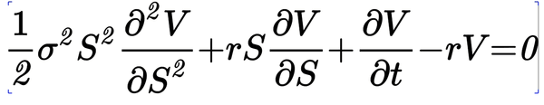

# MathJax editing

We added text editing capability to MathJax! Inspired by [LyX](www.lyx.org).

# Examples

## Selection and backspacing

## Fundamental theorem of calculus

## Black-Scholes equation

## Fourier transform

## Shannon entropy

## Wave equation

## Maxwell equation

